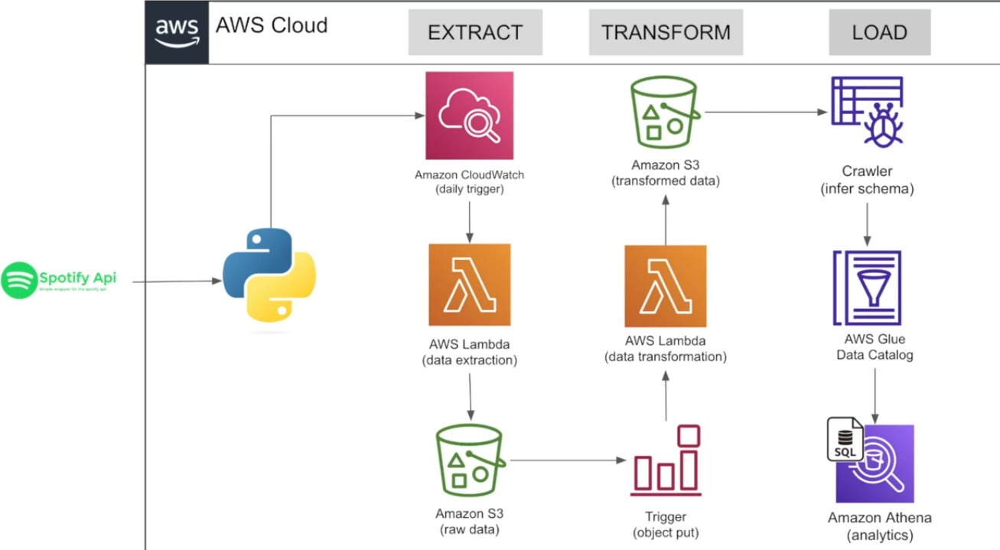

# Spotify_data
🎯 Project Title + Tagline
# 🎧 Spotify ETL Data Pipeline on AWS (Serverless Project)
End-to-end data pipeline that extracts data from Spotify API, transforms using AWS Lambda, and loads into S3, Glue & Athena for analytics.

🖼 Architecture Diagram

🧠 Project Description
This project extracts Spotify music data using their public API, stores raw data in Amazon S3 using AWS Lambda, transforms the data using another Lambda function, and makes it available for SQL querying with Athena through AWS Glue Data Catalog.

🧰 Tech Stack
- Python
- Spotify API
- AWS Lambda
- Amazon CloudWatch
- Amazon S3
- AWS Glue (Crawler + Data Catalog)
- Amazon Athena

⚙️ How the Pipeline Works (ETL Flow)
**Extract**:
- AWS Lambda (Python) connects to Spotify API
- Triggered daily via Amazon CloudWatch
- Raw data saved to `s3://spotify-raw/`

**Transform**:
- S3 ObjectPut event triggers a second Lambda
- Cleans and transforms the raw data
- Saves clean data to `s3://spotify-transformed/`

**Load & Query**:
- AWS Glue Crawler infers schema on transformed data
- Data is made queryable in Athena using SQL
